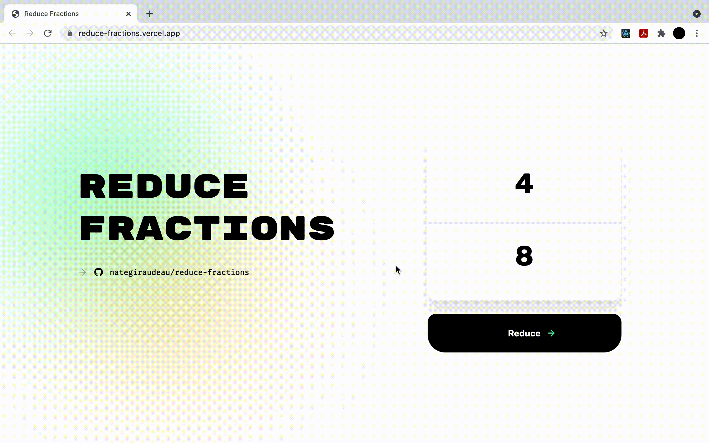

## Reduce Fractions

A web app built with [NextJS](https://github.com/vercel/next.js) that reduces fractions.

---

[Reduce a fraction &#8594;](http://reduce-fractions.vercel.app)

---


    
---

## Reduce Fractions Method (Typescript):

```ts
function reduceFraction(numerator: number, denominator: number): [number, number] {
    function gcd(a: number, b: number): number {
        return b ? gcd(b, a % b) : a;
    };

    let _gcd = gcd(numerator, denominator);

    return [numerator / _gcd, denominator / _gcd];
}
```
